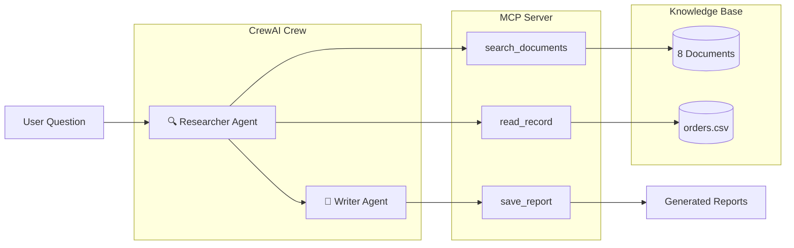

# 🤖 Ops Assistant — Week 14 Mini-Project

### Futurense AI Clinic · Multi-Agent Operations Assistant

<p align="center">
  
</p>

<p align="center">
  <strong>A production-style AI Operations Assistant powered by MCP + CrewAI.</strong><br>
  Search policies, analyze support tickets, inspect order records, and generate grounded reports with citations.
</p>

---

## ✨ Highlights

* 🔍 **Grounded Retrieval** — Answers are generated only from local documents and structured records
* 🤖 **Multi-Agent Architecture** — Separate Researcher and Writer agents
* 🧰 **Custom MCP Server** — Exposes business tools via the Model Context Protocol
* 📝 **Automatic Report Generation** — Reports are saved as Markdown files
* 🛡️ **Security First** — Pydantic validation prevents malformed inputs
* 🧪 **Fully Tested** — Unit tests and end-to-end tests included
* 📚 **Source Attribution** — Every claim includes document citations

---

## 🏗️ System Architecture



---

## 🚀 Why This Project?

Operations teams often spend valuable time manually searching through:

* Return policies
* Shipping guidelines
* Product notes
* Support tickets
* Inventory reports
* Customer orders

This assistant automates that workflow while ensuring **every answer is evidence-backed**.

> If evidence cannot be found, the system explicitly states so instead of hallucinating.

---

## 🛠️ Tech Stack

| Component             | Technology                 |
| --------------------- | -------------------------- |
| MCP Server            | FastMCP (Official MCP SDK) |
| Multi-Agent Framework | CrewAI                     |
| LLM Provider          | OpenRouter                 |
| Model                 | Llama 3.1 8B Instruct      |
| Validation            | Pydantic v2                |
| Testing               | Pytest                     |
| Language              | Python 3.11                |

---

## 📁 Project Structure

```text
ops-assistant/
├── data/                          # Sample knowledge base
│   ├── doc_01_return_policy.txt
│   ├── doc_02_shipping_policy.txt
│   ├── doc_03_product_note_headphones.txt
│   ├── doc_04_product_note_keyboard.txt
│   ├── doc_05_support_ticket_1042.txt
│   ├── doc_06_support_ticket_1087.txt
│   ├── doc_07_escalation_policy.txt
│   ├── doc_08_inventory_note.txt
│   └── orders.csv
│
├── server/
│   └── server.py
│
├── crew/
│   └── crew.py
│
├── tests/
│   ├── test_tools.py
│   └── test_e2e.py
│
├── outputs/
├── traces/
├── demo/
├── .env.example
├── decision_log.md
├── reflection.md
└── README.md
```

---

## 💡 Example Query

```text
What was the issue with order ORD-1042, how was it resolved,
and is the product still in stock?
```

### Example Output

```text
✓ Identified audio dropout issue affecting firmware v1.2 [doc_05]
✓ Resolution: Firmware updated to v1.3 [doc_05]
✓ Current inventory: 112 units available [doc_08]
✓ Report saved to outputs/report_20250607_141255.md
```

---

## 🔒 Security Features

* Input validation using **Pydantic**
* Prevention of malformed order IDs
* Maximum iteration limits for agents
* Environment variables managed via `.env`
* No hardcoded API keys
* MCP communication over secure stdio channels

---

## 🧪 Testing

```bash
# Run unit tests
python -m pytest tests/test_tools.py -v

# Run end-to-end tests
python -m pytest tests/test_e2e.py -v

# Run all tests
python -m pytest tests/ -v
```

---

## 👨‍💻 Author

**Team:** Shanmuk Kukati · Ankit Prashar

---
